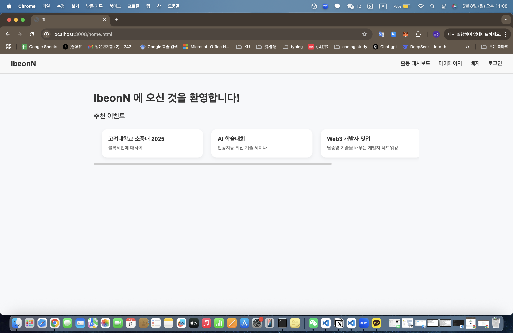
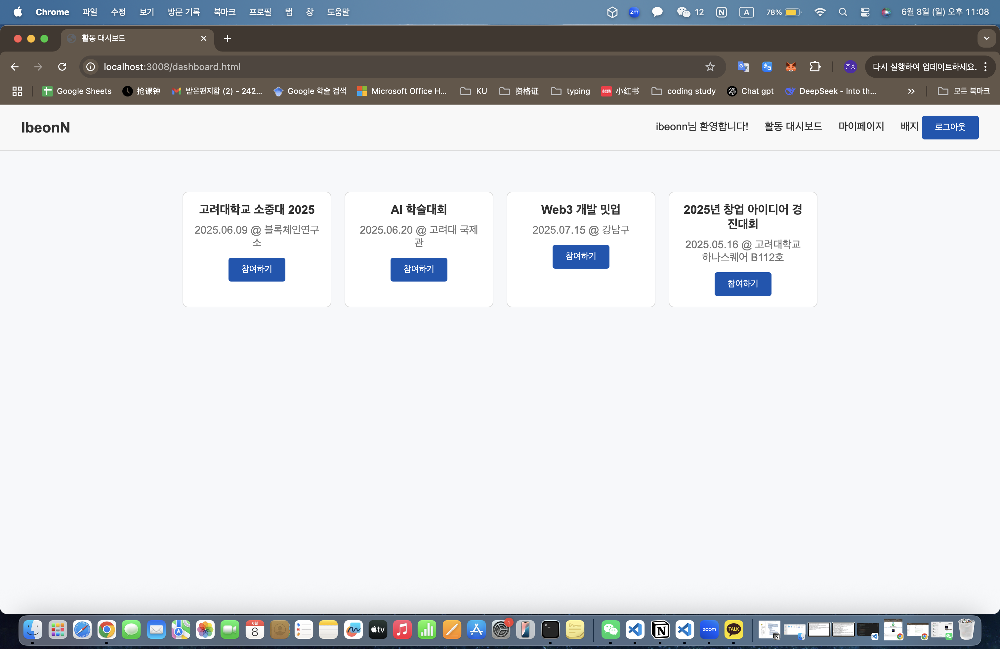
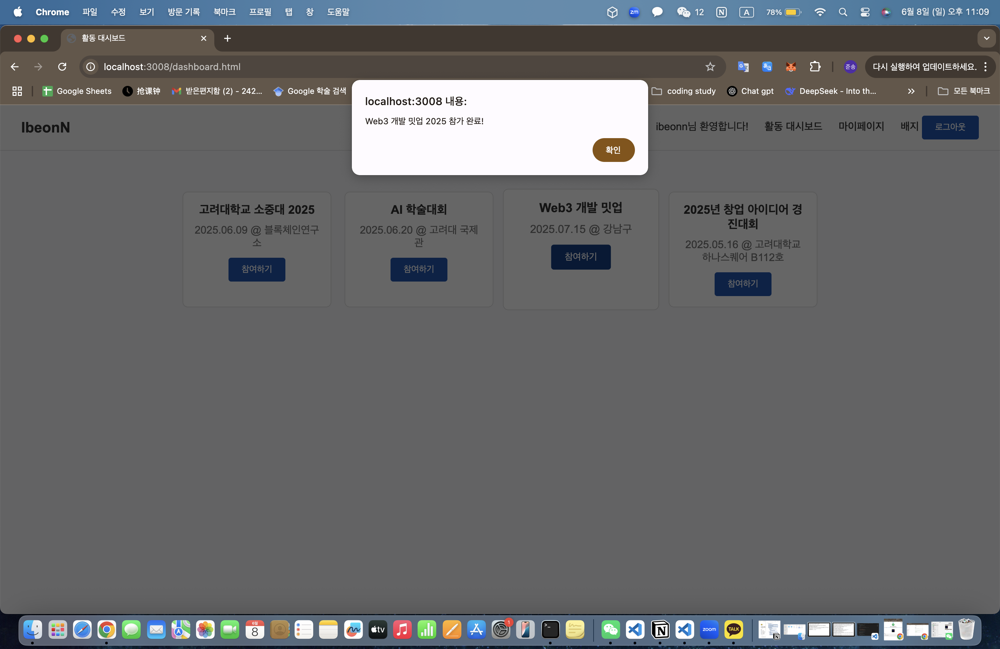
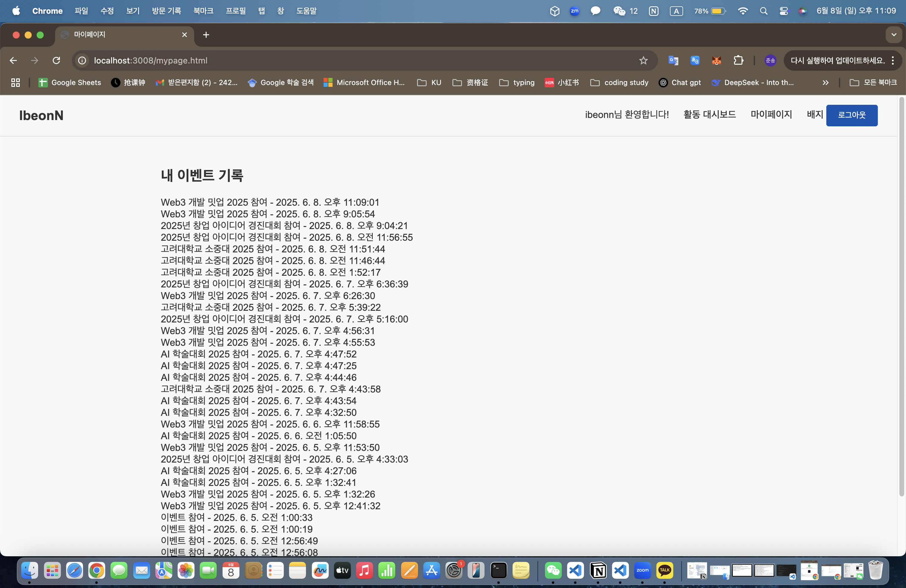
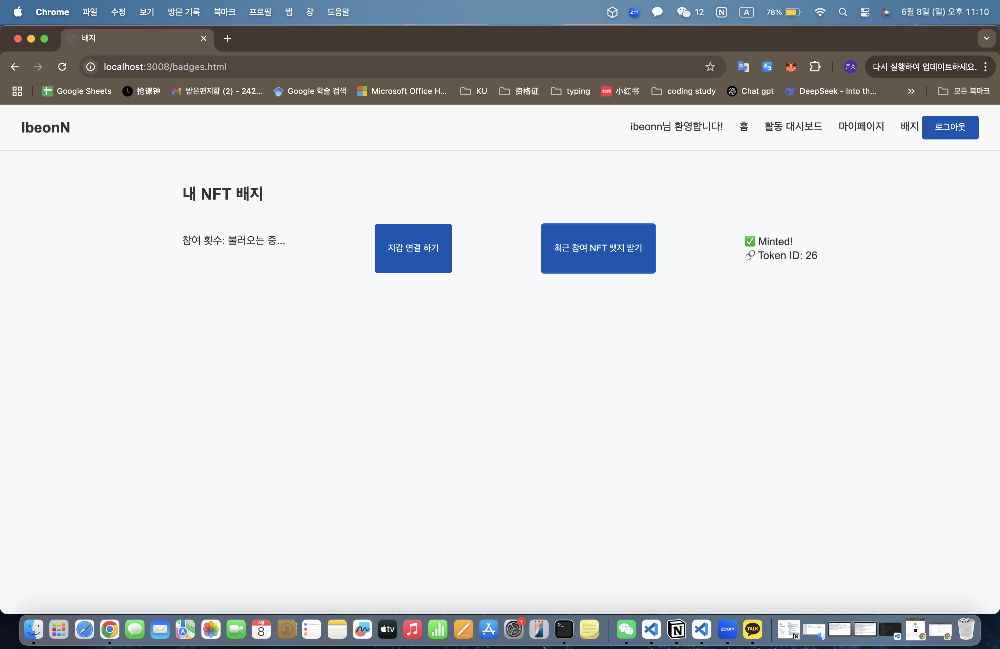
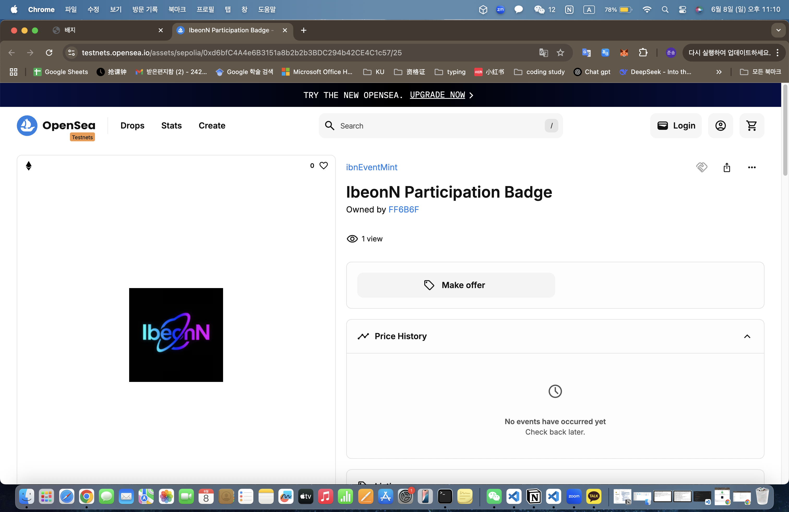

# IbeonN - Web2 + Web3 NFT Participation Proof System

## 🧾 Overview


**IbeonN** is a hybrid DApp that enables users to record their participation in academic or tech-related events and issue NFT badges as verifiable digital proof.  
The system integrates Web2 (login, event tracking, JSON export) with Web3 (IPFS + smart contract NFT minting), offering a seamless experience from registration to blockchain-based certification.
---

## 🌟 Features

- 🔐 Login & session handling using localStorage
- 📅 Dashboard for exploring & participating in curated events
- 📄 "My Page" listing all participation history
- 📥 One-click download of participation data in JSON format
- 🌐 Upload to IPFS using Pinata
- 🪪 Mint NFT badge based on participation metadata
- 🔗 View NFT badges on OpenSea (Sepolia Testnet)

---

## 🖼️ Screenshots

> 💡 Place the following images in a `/screenshots` folder inside your repository:

| Section             | Image Filename       |
|---------------------|----------------------|
| Home Page           | `home.jpg`           |
| Dashboard Page      | `dashboard.jpg`      |
| Participation Popup | `participated.jpg`   |
| My Page             | `mypage.jpg`         |
| NFT Minting Page    | `mint.jpg`           |
| OpenSea View        | `opensea.jpg`        |

```markdown






---

## 🛠️ Tech Stack

Frontend: HTML, CSS, JavaScript (Vanilla)

Backend: Node.js, Express.js

Database: MongoDB (via Mongoose)

Blockchain / Web3:

IPFS (via Pinata)

NFT Metadata JSON

ERC-721 Smart Contract (Hardhat)

ethers.js

---

## 📂 Project Structure

IbeonN/
├── public/
│   ├── home.html
│   ├── login.html
│   ├── dashboard.html
│   ├── event 1.html ~ event 4.html
│   ├── mypage.html
│   ├── badges.html
│   ├── css/style.css
│   └── js/main.js
├── models/
│   ├── User.js
│   ├── Event.js
│   └── Participation.js
├── server.js
├── uploadjson.js
├── mint.js
├── metadata.json
├── participation.json
├── .env

---

🚀 How to Run

# 1. Install project dependencies
npm install

# 2. Start the backend server (runs at localhost:3008)
node server.js

# 3. Upload your JSON participation metadata to IPFS
node uploadjson.js

# 4. Mint NFT based on uploaded metadata
node mint.js

Once started, open your browser and visit:
👉 http://localhost:3008/home.html

---

🪪 Example NFT Badge
NFT minted from this app can be viewed here:
🔗 [View on OpenSea (Sepolia)](https://testnets.opensea.io/assets/sepolia/0xd6bfC4A4e6B3151a8b2b2b3BDC294b42CE4C1c57/25)

---

🙋 Author
Developed by Junson/SHEN JUNSONG (신준송)
📍 Department of Computer Science, Korea University
🛠️ As part of a 2025 blockchain lab internship & Web3 DApp demo project.
🔗 GitHub: https://github.com/dvaramg

